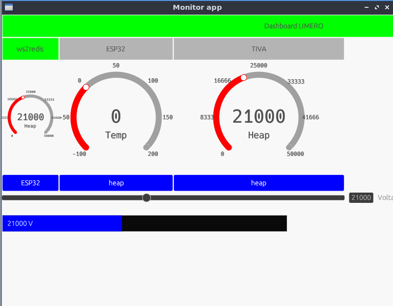

# egui-dashboard
A configurable dashboard for MQTT or Redis Publish / Subscribe system.
It provides outputs like : Status, Gauge, Graphs, Progress
It provides inputs like : Slider, Button, Switch, ValueInput
## Example
```xml
<Dashboard h="768" w="1024" url="https://pcthink.local:353/ws"
    xmlns="config">
    <Row h="40">
        <Label label="Dashboard LIMERO " w="400" text_size="30" src="src/ws2redis/system/alive"/>
    </Row>
    <Row h="40">
        <Status w="100" src="src/ws2redis/system/alive" ok="true" nok="false" label="ws2redis" />
        <Status w="200" src="src/esp32/sys/alive" ok="true" nok="false" label="ESP8266" />
        <Status w="300" src="src/tiva/sys/alive" ok="true" nok="false" label="TIVA" />
    </Row>
    <Row h="150">
        <Gauge w="100" src="src/esp32/sys/heap" min="0.0" max="50000.0" label="Heap" unit="Bytes" />
        <Gauge w="200" src="src/esp32/sys/temp" min="-100" max="200" label="Temp" unit="C" />
        <Gauge w="300" src="src/esp32/sys/heap" min="0.0" max="50000.0" label="Heap" />
        <Gauge w="400" src="src/esp32/sys/heap" min="0.0" max="50000.0" label="Heap" />
    </Row>
    <Row h="30">
        <Button w="100" label="RESET" dst="dst/esp32/sys/reset" pressed="true" released="false" />
        <Button w="200" label="LED" dst="dst/esp32/sys/led" pressed="on" released="off" />
    </Row>
    <Col h="500">
        <Table h="100" w="250" src="src/esp32/*" label="ESP32" timeout="1000" />
        <Slider label="Voltage" w="500" unit="V" dst="dst/esp32/sys/voltage" min="0.0" max="5.0" step="0.1" />
        <Switch label="Power" w="500" dst="dst/esp32/sys/power" on="on" off="off" />
        <Plot label="Voltage" w="500" unit="V" src="src/esp32/sys/voltage" min="0.0" max="5.0" msec="10000" />
        <Label label="Just a label text" h="40" text_size="10"/>
        <ValueOutput label="Voltage" w="500" unit="V" prefix="$" src="src/esp32/sys/voltage" />
        <Progress label="Voltage" unit="V" w="500" h="20" src="src/esp32/sys/voltage" min="0.0" max="5.0" />
        <Map label="Location" image="img/map.png" w="500" src="src/esp32/sys/location" />
        <Compass label="direction" w="100" src="src/esp32/sys/compass" />
        <ValueInput label="Voltage" unit="V" w="500" src="src/esp32/sys/voltage" />
    </Col>
</Dashboard>
```
 

# PubSub widgets
## Button 
- PushButton is a simple push button. It sends a message when pressed ( and another message when released. depending on configuration)
- ToggleButton is a push button that toggles between two states. It sends a message when pressed. It listens to a message to change its state.
- Plot is a time series plot. It listens to a message and adds the value to the plot. It can/should handle multiple sources.
## Graphic
- Gauge is a gauge. It listens to a message and sets the gauge value. It can/should handle multiple sources.
- Progress is a progress bar. It listens to a message and sets the progress bar. Vertical or horizontal
- Status is a status indicator. It listens to a message and sets the status. It can/should handle multiple sources. It can capture min and max values.
- Slider is a slider. The slider value is shown, but only send when the slider is released. 
- Label is a simple label. It listens to a message and sets the label text. 
- Bar is a bar graph. It listens to a message and adds the value to the bar graph. It can/should handle multiple sources.
- Map is a map. It listens to a message and sets the location ( + speed vector ) on the map. It can/should handle multiple sources.
- Image is an image. It listens to a message and sets the image.
## Text
- InputText is a text input field. it sends the value when the field is left. The result is a string.
- InputNumber is a number input field. it sends the value when the field is left. The result is a number.
- Table is a table. It listens to a message and adds the value to the table. It can/should handle multiple sources.
# Layout
- Row is a horizontal layout. It can contain multiple widgets.
- Col is a vertical layout. It can contain multiple widgets.
- Dashboard is the root layout. It can contain multiple widgets.
- Tab is a tab layout. It can contain multiple widgets.

# PubSub Parameters
- src is the source of the message. It can be a wildcard. It can be a list of sources. It can be a list of sources with a wildcard.
- dst is the destination of the message. It can be a list of destinations. It can be a list of destinations with a wildcard.
- url is the url of the PubSub server. It can be a list of urls. It can be a list of urls with a wildcard.
- timeout is the timeout of the widget, it will look disabled when no new message arrives in the timeout period.
- min is the minimum value of the widget. 
- max is the maximum value of the widget.
- step is the step value of the widget.
- unit is the unit of the widget.
# PubSub Brokers
- MQTT 
- Redis 
- Zenoh 
# TimeSeries broker
- InfluxDB
- Redis
# PubSub protocol
- CBOR ( preferred - efficient and more types )
- JSON 


